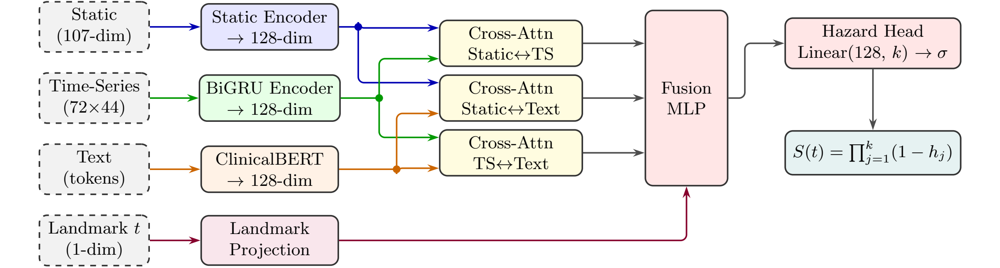

# Multi-Modal Deep Learning for ICU Time-to-Discharge Prediction

> **A Landmark Dynamic Survival Analysis Approach**

A multi-modal deep survival framework that integrates static clinical features, high-frequency physiological time-series, and unstructured radiology reports to predict ICU time-to-discharge, built on the MIMIC-IV (v3.1) database with 76,943 ICU stays.

---

## Table of Contents

- [Overview](#overview)
- [Architecture](#architecture)
- [Project Structure](#project-structure)
- [Installation](#installation)
- [Pipeline](#pipeline)
- [Experiments](#experiments)
- [Key Results](#key-results)
- [Evaluation Metrics](#evaluation-metrics)
- [Data](#data)
- [Course Information](#course-information)

---

## Overview

Predicting ICU time-to-discharge is a critical survival analysis task that supports bed management and proactive care planning. Traditional approaches rely on single-modality data and static one-time predictions. This project overcomes these limitations through:

1. **Landmark Dynamic Prediction**: Instead of a single admission-time forecast, the model generates updated predictions at three clinically meaningful time points ($t_{obs} \in \{24, 48, 72\}$ hours), conditioning on all clinical data accumulated up to that point.

2. **Multi-Modal Fusion**: Three heterogeneous data sources are jointly modeled:
   - **Static features** (107-dim): admission demographics, first-24h lab/vital summaries, SOFA scores
   - **Time-series** (22 channels × 72h): hourly vitals, labs, organ failure scores with binary observation masks
   - **Clinical text**: radiology reports encoded by frozen [ClinicalBERT](https://huggingface.co/emilyalsentzer/Bio_ClinicalBERT)

3. **Discrete-Time Survival**: The residual length-of-stay is discretized into $K=16$ quantile-based bins. The model outputs per-bin hazard probabilities, from which full survival curves are derived via $S(t_k) = \prod_{j=1}^{k}(1 - h_j)$.

4. **Rigorous Evaluation**: 5-fold subject-level stratified cross-validation with strict train-only preprocessing to prevent data leakage.

---

## Architecture

The model consists of three modality-specific encoders, pairwise cross-attention fusion, and a discrete survival prediction head:

<p align="center">
  
</p>

### Component Details

| Component | Architecture | Output |
|-----------|-------------|--------|
| **Static Encoder** | Linear(107→256) → LayerNorm → ReLU → Dropout(0.3) → Linear(256→128) → ReLU | 128-dim summary |
| **TS Encoder** | 2-layer BiGRU (hidden=128/dir) → Linear projection | 128-dim sequence + summary |
| **Text Encoder** | Frozen ClinicalBERT → Linear(768→128) → ReLU → Dropout(0.3) | 128-dim token sequence |
| **Cross-Attention** | 3 pairwise modules (Static↔TS, Static↔Text, TS↔Text), 4 heads, residual + LayerNorm | 3 × 128-dim |
| **Fusion MLP** | Concat(7 × 128-dim + 1 scalar) → 897→512→256→128 with LayerNorm + Dropout | 128-dim |
| **Hazard Head** | Linear(128→16) → Sigmoid | 16 bin hazard probs |

### Loss Function

Discrete-time survival negative log-likelihood (NLL) with right-censoring support and subject-level inverse-frequency sample weighting:

- **Uncensored** (alive discharge): $\mathcal{L}_i = -w_i \left[\log S_i(b_{k_i}) + \log h_i(k_i)\right]$
- **Censored** (ICU death): $\mathcal{L}_i = -w_i \log S_i(b_{k_i+1})$

where $S_i$ is the predicted survival function, $h_i(k_i)$ is the hazard at the event bin, and $w_i$ is a normalized subject-level inverse-frequency weight ensuring equal per-subject contribution.

### Training Configuration

| Hyperparameter | Value |
|---------------|-------|
| Optimizer | AdamW (lr=1e-3, weight_decay=1e-4) |
| LR Scheduler | ReduceLROnPlateau (factor=0.5, patience=3) |
| Batch Size | 32 |
| Max Epochs | 20 |
| Early Stopping | Patience = 5 (on validation loss) |
| ClinicalBERT | Frozen (no fine-tuning) |

---

## Project Structure

```
├── models/                      # Model definitions
│   ├── network.py               #   MultiModalSurvival, encoders, cross-attention
│   └── engine.py                #   NLL loss, training loop, prediction
│
├── datasets/                    # Data loading
│   └── icu_dataset.py           #   PyTorch Dataset, collate, TS prefix extraction
│
├── utils/                       # Shared utilities
│   ├── options.py               #   Global config: paths, hyperparameters, feature lists
│   ├── data_utils.py            #   Cohort building, preprocessing, text cleaning, discretization
│   ├── evaluate.py              #   Survival metrics (C-index, IBS, NBLL via pycox)
│   └── util.py                  #   IO helpers (JSON/pickle), seed management
│
├── scripts/                     # Executable pipeline scripts
│   ├── prepare.py               #   Step 1: cohort → CV splits → dynamic samples
│   ├── preprocess.py            #   Step 2: static/timeseries/text feature preprocessing
│   ├── train_baselines.py       #   Step 3a: Cox PH / XGBoost survival baselines
│   ├── train_multimodal.py      #   Step 3b: Multi-modal deep model training + evaluation
│   ├── run_sequential.py        #   Helper: fold-by-fold training (avoids OOM)
│   ├── analyze.py               #   Step 4: MAE analysis + metric visualization
│   └── plot_bin_sensitivity.py  #   Sensitivity: time-bin granularity analysis
│
├── report/                      # LaTeX report and figures
│   ├── report.tex
│   ├── generate_figures.py
│   └── figures/
│
├── artifacts/                   # Generated artifacts (not fully in repo)
│   ├── splits/                  #   5-fold CV split JSONs ✓ (in repo)
│   ├── dynamic_samples/         #   Landmark-expanded samples ✓ (in repo)
│   ├── cohort/                  #   Cohort pickles (local only)
│   ├── features/                #   Preprocessed features (local only)
│   ├── models/                  #   Trained model weights (local only)
│   └── results/                 #   Prediction outputs + metrics (local only)
│
└── requirements.txt
```

---

## Installation

```bash
# Clone the repository
git clone https://github.com/hollylewis977-ui/SPH6004-Assignment2.git
cd SPH6004-Assignment2

# Create virtual environment (recommended)
python -m venv venv
source venv/bin/activate  # Linux/Mac
venv\Scripts\activate     # Windows

# Install dependencies
pip install -r requirements.txt
```

### Requirements

| Package | Version | Purpose |
|---------|---------|---------|
| torch | >= 2.0 | Deep learning framework |
| transformers | >= 4.30 | ClinicalBERT (`emilyalsentzer/Bio_ClinicalBERT`) |
| scikit-learn | >= 1.3 | KNN imputation, StandardScaler, OneHotEncoder |
| scikit-survival | >= 0.22 | Cox PH baseline, concordance index |
| pycox | >= 0.2 | EvalSurv (C-index, IBS, NBLL) |
| lifelines | >= 0.27 | Kaplan-Meier curves |
| xgboost | >= 2.0 | XGBoost survival baseline |
| pandas | >= 2.0 | Data manipulation |
| numpy | >= 1.24 | Numerical computing |
| matplotlib | >= 3.7 | Visualization |

---

## Pipeline

The full pipeline runs in 4 steps from the `Assignment 2/` directory:

### Step 1: Data Preparation

```bash
python scripts/prepare.py
```

Sequentially executes:
1. **Build cohort**: Load MIMIC-IV static CSV, remove leakage columns (`outtime`, `los`, `deathtime`, etc.) and high-missingness features (>60%)
2. **Create splits**: 5-fold Stratified Group K-Fold by `subject_id` (same patient never across folds)
3. **Expand dynamic samples**: For each stay, create rows at landmarks {24, 48, 72}h (only if `icu_los_hours > landmark`)

### Step 2: Feature Preprocessing

```bash
python scripts/preprocess.py                    # All three modalities
python scripts/preprocess.py --modality static   # Static only
python scripts/preprocess.py --modality timeseries
python scripts/preprocess.py --modality text
```

- **Static**: KNN imputation (k=10) → StandardScaler → OneHotEncoder (gender binarized, race collapsed to 5 groups)
- **Time-series**: Build per-stay time-series bank, compute per-fold Z-score normalization statistics
- **Text**: Clean radiology reports (`[DEID]` tokens), head-tail windowing (192/64 for summaries, 96/160 otherwise), enforce landmark-safe filtering (`note_time ≤ intime + t_obs`)

All preprocessors are **fit exclusively on training data** to prevent leakage.

### Step 3: Training

```bash
# Classical baselines (static features only)
python scripts/train_baselines.py --model cox
python scripts/train_baselines.py --model xgb

# Multi-modal deep model (full tri-modal)
python scripts/train_multimodal.py --experiment-name multimodal_main --device cuda

# Sequential fold training (recommended to avoid GPU OOM)
python scripts/run_sequential.py --experiment-name multimodal_main --device cuda
```

### Step 4: Evaluation

```bash
# MAE analysis across all models (full cohort / LOS 1-21d / LOS 1-4d)
python scripts/analyze.py --mode mae

# Metric visualization for a specific experiment
python scripts/analyze.py --mode plots --result-dir artifacts/results/multimodal_main

# Both
python scripts/analyze.py --mode all --result-dir artifacts/results/multimodal_main
```

---

## Experiments

### Ablation Study

Seven model configurations trained to isolate each modality's contribution:

```bash
# Single modality
python scripts/train_multimodal.py --disable-ts --disable-text --experiment-name ablation_static_only
python scripts/train_multimodal.py --disable-static --disable-text --experiment-name ablation_ts_only
python scripts/train_multimodal.py --disable-static --disable-ts --experiment-name ablation_text_only

# Dual modality
python scripts/train_multimodal.py --disable-text --experiment-name ablation_static_ts
python scripts/train_multimodal.py --disable-ts --experiment-name ablation_static_text
python scripts/train_multimodal.py --disable-static --experiment-name ablation_text_ts

# Full tri-modal (default)
python scripts/train_multimodal.py --experiment-name multimodal_main
```

### Sensitivity Analyses

**Time-bin granularity** ($K \in \{4, 8, 16, 32\}$, 30% training subsample):

```bash
python scripts/train_multimodal.py --num-bins 4 --train-subject-fraction 0.3 --experiment-name sensitivity_bins4
python scripts/train_multimodal.py --num-bins 8 --train-subject-fraction 0.3 --experiment-name sensitivity_bins8
# ... etc.
```

**Censoring assumption** (exclude ICU deaths):

```bash
python scripts/train_multimodal.py --exclude-icu-deaths --num-bins 8 --experiment-name censoring_exclude_deaths
```

---

## Key Results

### Main Ablation Results (5-fold CV, mean ± std)

| Category | Model | Macro C-index ↑ | Macro IBS ↓ | Macro NBLL ↓ |
|----------|-------|:---:|:---:|:---:|
| Baseline | Cox PH | 0.7047 ± 0.002 | 0.0372 ± 0.002 | 0.1004 ± 0.007 |
| Baseline | XGBoost | 0.7154 ± 0.018 | 0.0390 ± 0.002 | 0.1035 ± 0.006 |
| Single | Static Only | 0.7208 ± 0.024 | 0.0301 ± 0.021 | 0.1119 ± 0.068 |
| Single | TS Only | 0.7358 ± 0.029 | 0.0296 ± 0.024 | 0.1141 ± 0.079 |
| Single | Text Only | 0.6489 ± 0.017 | 0.0337 ± 0.033 | 0.1276 ± 0.095 |
| Dual | Static + TS | 0.7512 ± 0.024 | 0.0279 ± 0.023 | 0.1035 ± 0.071 |
| Dual | Static + Text | 0.7636 ± 0.026 | 0.0288 ± 0.023 | 0.1066 ± 0.052 |
| Dual | TS + Text | 0.7594 ± 0.060 | 0.0289 ± 0.022 | 0.1104 ± 0.065 |
| **Full** | **Static + Text + TS** | **0.7810 ± 0.006** | **0.0276 ± 0.002** | **0.1020 ± 0.004** |

### MAE Point-Prediction Accuracy (hours)

| Model | Full Cohort | LOS 1-21d | LOS 1-4d |
|-------|:---:|:---:|:---:|
| Cox PH | 72.1 ± 1.1 | 65.0 ± 1.1 | 40.0 ± 0.6 |
| XGBoost | 71.0 ± 0.9 | 62.4 ± 0.9 | 53.1 ± 0.9 |
| Static | 60.7 ± 1.6 | 50.7 ± 1.8 | 36.3 ± 3.2 |
| TS | 61.6 ± 1.0 | 51.3 ± 1.8 | 35.6 ± 2.2 |
| **Full (S+T+TS)** | **52.1 ± 1.5** | **42.1 ± 1.9** | **23.7 ± 2.6** |

### Key Findings

- The **full multi-modal model improves C-index by +6.0 points** over the best single-modality model
- **Time-series becomes more informative at later landmarks** (C-index: 0.7242 at 24h → 0.7445 at 72h), while static features are most predictive at 24h
- **Text modality provides the largest complementary gain** (+0.0428 when added to static), despite weak standalone performance, because it captures qualitative pathological descriptions not present in numerical data
- The full model achieves the **smallest C-index standard deviation** (±0.006), demonstrating both accuracy and stability

---

## Evaluation Metrics

| Metric | Description | Direction |
|--------|-------------|-----------|
| **Time-dependent C-index** | Antolini's concordance — discrimination of predicted risk orderings against observed event times | Higher ↑ |
| **Integrated Brier Score (IBS)** | Joint calibration + discrimination over the full survival curve | Lower ↓ |
| **Integrated NBLL** | Proper scoring rule for predicted survival distributions | Lower ↓ |
| **MAE** | Mean absolute error between predicted and observed residual LOS (uncensored only) | Lower ↓ |

All survival metrics are computed via `pycox.EvalSurv` with Kaplan-Meier censoring adjustment, separately per landmark (24h, 48h, 72h) and macro-averaged.

---

## Data

This project uses the **MIMIC-IV v3.1** database, which requires credentialed access:

- **Source**: [PhysioNet — MIMIC-IV](https://physionet.org/content/mimiciv/3.1/)
- **Access**: Requires CITI training + signed data use agreement
- **Cohort**: 76,943 ICU stays from 53,569 unique subjects
- **Alive discharge rate**: 92.7% (ICU mortality 7.3%, treated as right-censoring)

Raw data files are **not included** in this repository due to access restrictions. The repository includes pre-computed 5-fold cross-validation splits and landmark-expanded dynamic samples.

---

## Course Information

**SPH6004** — Advanced Statistical Learning in Healthcare  
Saw Swee Hock School of Public Health, National University of Singapore  
AY 2025–2026
